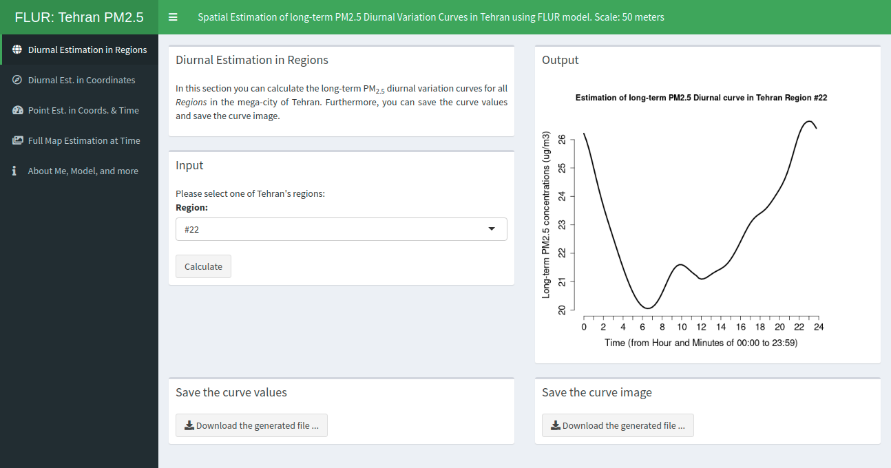
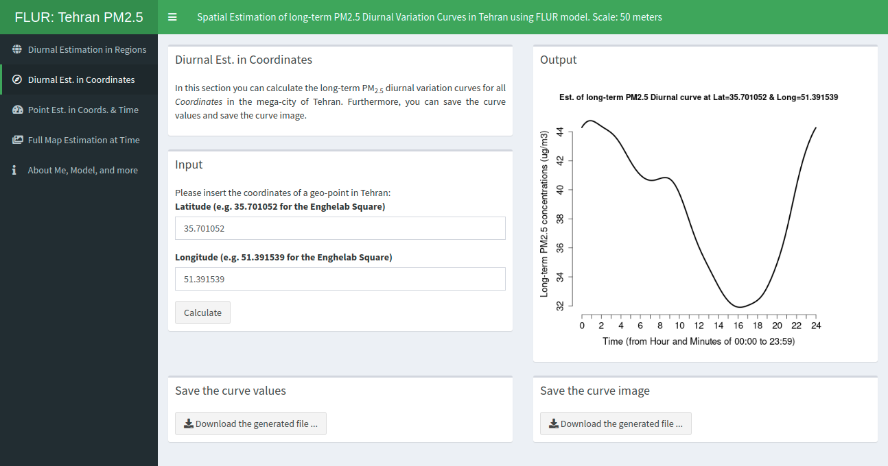
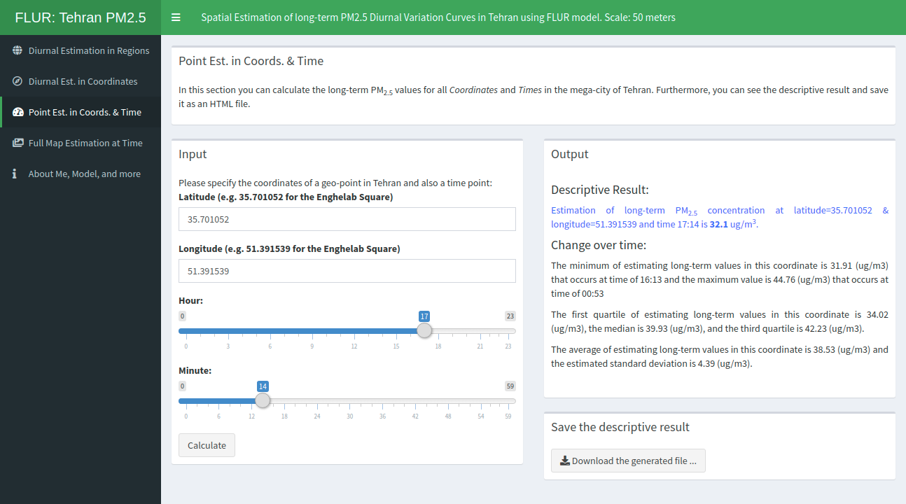
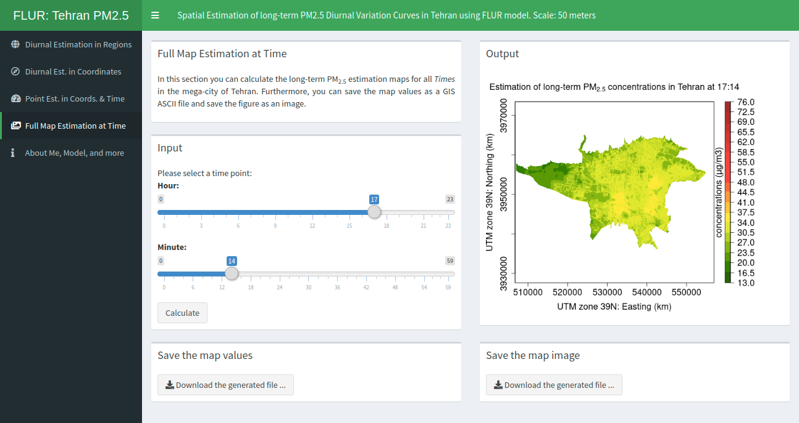
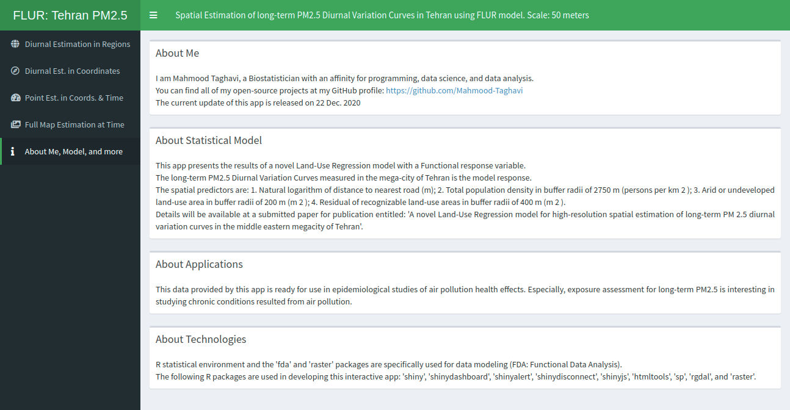

# FLUR
An R Shiny interactive web Application for presenting results of a novel Functional Land-Use Regression (FLUR) model that spatially predict *Long-term diurnal variation curves* of fine particulate matter (PM~2.5~) in the mega-city of Tehran.

# Screenshots

## Screenshot 1a: Diurnal Estimation in Region #1

## Screenshot 1b: Diurnal Estimation in Region #22

## Screenshot 2: Diurnal Estimation in Coordinates

## Screenshot 3: Point Estimation in Coordinates and a Time

## Screenshot 4: Full Map Estimation of the pollutant concentrations at a Time

## Screenshot 5: About Me, Statistical Model, Applications, and Technologies
